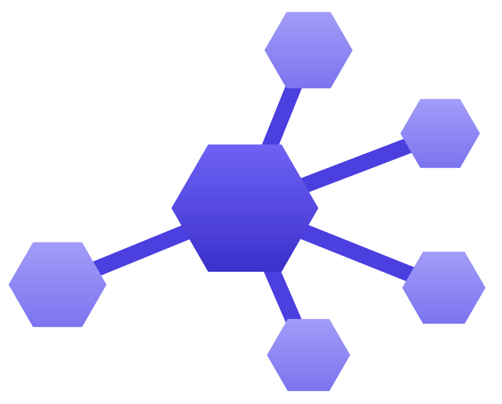

<div class="sa-hero" markdown>



# Subagents

<p class="sa-tagline">Compose LLM agents into typed, concurrent workflows.</p>

<p class="sa-subtitle">
A small framework for wiring plain Python functions — and the agents inside them — into a
graph that runs branches in parallel, routes on conditions, and threads one typed state
object through the whole thing.
</p>

[Get started :octicons-arrow-right-24:](getting-started.md){ .md-button .md-button--primary }
[View on GitHub](https://github.com/sayedshaun/subagents){ .md-button }

<p class="sa-badges">


</p>

</div>

## Why Subagents

- **Two dependencies. That's it.** `httpx` and `pydantic`. Providers talk to vendor REST APIs
  directly — no OpenAI SDK, no `google-genai`, no transitive dependency sprawl.
- **Your state is a dataclass.** Not an untyped dict. Your editor autocompletes it, your type
  checker checks it.
- **Nodes are just functions.** Sync or async, decorated in place. No base class to inherit,
  no runner object to construct.
- **Parallel by default.** Independent branches run concurrently via `asyncio`; sync functions
  are offloaded to threads so a blocking call never stalls the event loop.
- **Agents are optional.** The graph engine has no idea what an LLM is. Use it for plain
  function orchestration, or drop an [`Agent`](guide/agents.md) inside a node.

## Install

```bash
pip install subagents
```

Requires Python 3.11+.

## Where to go next

<div class="grid cards" markdown>

-   :material-rocket-launch:{ .lg .middle } **Getting started**

    ---

    Install the package and run your first graph in a few lines.

    [:octicons-arrow-right-24: Getting started](getting-started.md)

-   :material-graph-outline:{ .lg .middle } **Graphs**

    ---

    State, nodes, edges, conditional routing, and parallel merging.

    [:octicons-arrow-right-24: Graphs guide](guide/graph.md)

-   :material-robot-outline:{ .lg .middle } **Agents**

    ---

    Think/act loops, tools, token budgets, and session persistence.

    [:octicons-arrow-right-24: Agents guide](guide/agents.md)

-   :material-api:{ .lg .middle } **API reference**

    ---

    The full public surface: signatures, parameters, return types.

    [:octicons-arrow-right-24: API reference](reference/api.md)

</div>
